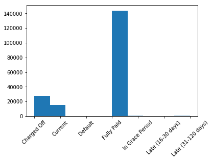
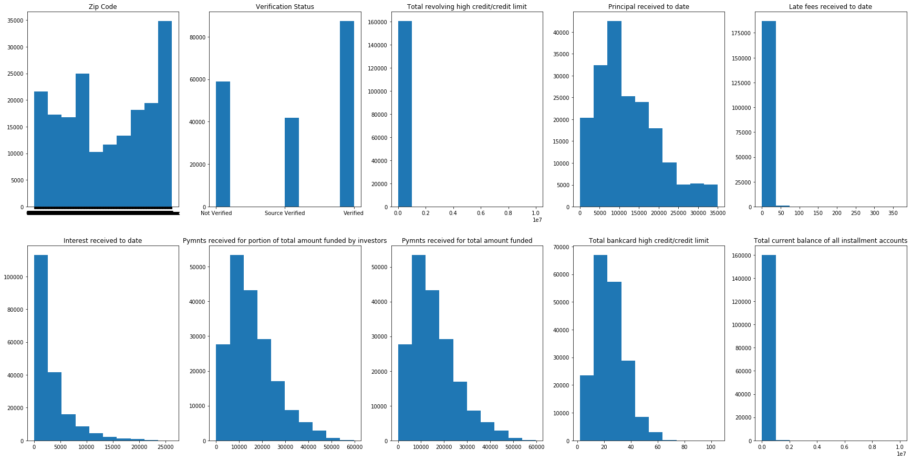

## Importing Libraries


```python
import numpy as np
import matplotlib.pyplot as plt
import pandas as pd
import matplotlib as mpl
```

## Custom Variable Scoring Function


```python
def variable_score(X_train,Y_train):

    
    #__________________Decision_Tree_____________________________________
    from sklearn.ensemble import ExtraTreesClassifier

    model = ExtraTreesClassifier()
    model.fit(X_train, Y_train)

    tree_importance = zip(X_test.columns, model.feature_importances_.tolist())
    tree_importance = np.asarray(list(tree_importance))
    tree_importance = np.sort(tree_importance, axis = 0)[::-1]
    tree_importance = pd.DataFrame(tree_importance, columns = ['Feature','Tree_Importance_Score'])
    tree_importance.set_index('Feature', inplace=True)
    
    feature_importance = tree_importance
    
    #__________________Correlation_____________________________________
    
   
    import math

    cor_list = []

    for column in X_train.columns:
        list_to_append = [column, X_train[column].corr(Y_train)]
        if math.isnan(list_to_append[1]):
            list_to_append[1] = 0
        cor_list.append(list_to_append)

    cor_list = np.asarray(cor_list)
    cor_list = np.sort(cor_list, axis = 0)[::-1]
    cor_list = pd.DataFrame(cor_list, columns = ['Feature','Correlation_with_Target'])
    cor_list.set_index('Feature', inplace=True)

    feature_importance = feature_importance.join(cor_list)
    
    return feature_importance
    
```

## Reading in Data


```python
df = pd.read_csv('LendingClub2012to2013.csv', skiprows=1, low_memory=False)
print(df.shape)

df = df[pd.notnull(df['loan_status'])]

# Keeping a backup copy of the data
df_orginal = df.copy()
```

    (188183, 115)
    

## Initial Dropping

Dropping variables is initally based on percent of values missing and text columns with too many different classes.


```python
not_missing = df.apply(lambda x: (x.count()/df.shape[0])).sort_values()
not_missing = not_missing[not_missing < .5]
print(not_missing)
not_missing = not_missing.index.values.tolist()
df.drop(not_missing, axis=1, inplace = True)
```

    annual_inc_joint                  0.000000
    inq_fi                            0.000000
    all_util                          0.000000
    max_bal_bc                        0.000000
    open_rv_24m                       0.000000
    open_rv_12m                       0.000000
    il_util                           0.000000
    total_cu_tl                       0.000000
    total_bal_il                      0.000000
    open_il_24m                       0.000000
    open_il_12m                       0.000000
    open_il_6m                        0.000000
    open_acc_6m                       0.000000
    verification_status_joint         0.000000
    dti_joint                         0.000000
    mths_since_rcnt_il                0.000000
    inq_last_12m                      0.000000
    next_pymnt_d                      0.088883
    mths_since_last_record            0.092857
    mths_since_last_major_derog       0.172791
    mths_since_recent_bc_dlq          0.195296
    mths_since_recent_revol_delinq    0.289333
    mths_since_last_delinq            0.428354
    desc                              0.432977
    dtype: float64
    


```python
df_obj = df.select_dtypes(include = ['object'])
too_many = df_obj.apply(lambda x: (x.nunique() / df.shape[0])).sort_values(ascending=False)
print(too_many)
too_many = too_many[too_many >= .2].index.values.tolist()
df.drop(too_many, axis=1, inplace = True)
```

    id                     1.000000
    url                    1.000000
    emp_title              0.612102
    title                  0.238839
    revol_util             0.005675
    zip_code               0.004458
    earliest_cr_line       0.003263
    int_rate               0.000771
    last_credit_pull_d     0.000319
    last_pymnt_d           0.000314
    addr_state             0.000260
    sub_grade              0.000186
    issue_d                0.000128
    purpose                0.000069
    emp_length             0.000058
    loan_status            0.000037
    grade                  0.000037
    home_ownership         0.000027
    verification_status    0.000016
    term                   0.000011
    initial_list_status    0.000011
    application_type       0.000005
    pymnt_plan             0.000005
    dtype: float64
    

## Data Transformation

Label econding, imputation, train/test split


```python
# Label encoding

from sklearn.preprocessing import LabelEncoder

label = LabelEncoder()
cols = df.select_dtypes(include = ['object']).keys().tolist()
for column in cols:
    df[column] = label.fit_transform(df[column].astype('str'))
```


```python
# Imputation: Median

df.fillna(df.median(), inplace = True)
```


```python
# Train/Test Splits

Y = df['loan_status']
X = df.drop('loan_status',axis=1)

from sklearn.model_selection import train_test_split

# Generating the final test set:
X_train, X_test_final_test, Y_train, Y_final_test = train_test_split(X,Y, test_size = .2)

# Generating the expirment set: 
X_train, X_test, Y_train, Y_test = train_test_split(X_train,Y_train, test_size = .1)

print("Final test size: " + str(Y_final_test.shape[0]))
print("Intermediate test size: " + str(Y_test.shape[0]))
print("Training size: " + str(Y_train.shape[0]))
```

    Final test size: 37637
    Intermediate test size: 15055
    Training size: 135489
    


```python
# Scale

from sklearn.preprocessing import StandardScaler

scaler = StandardScaler()
X_train = pd.DataFrame(scaler.fit_transform(X_train), columns=X_train.columns)
```

## Removing Features with Little Variance


```python
from sklearn.feature_selection import VarianceThreshold

print('Features:',X_train.shape[1])

# Remove all features that are either one or zero (on or off) in more than 90% of the samples
# http://scikit-learn.org/stable/modules/feature_selection.html
selector = VarianceThreshold(threshold=(.9 * (1 - .9)))
selector = selector.fit(X_train)

selector.get_support

variance = zip(X_test.columns, selector.get_support())
variance = np.asarray(list(variance))


below_threshold = variance[variance[:,1] == 'False'][:,0]
print('Feature(s) to be dropped:', below_threshold)


labels = X_train.columns.tolist()  

# List Comprehension to remove labels: https://stackoverflow.com/questions/4211209/remove-all-the-elements-that-occur-in-one-list-from-another                             
labels = [x for x in labels if x not in below_threshold]
X_train = pd.DataFrame(selector.fit_transform(X_train), columns=labels)
print('Features:',X_train.shape[1])
```

    Features: 86
    Feature(s) to be dropped: ['pymnt_plan' 'policy_code' 'application_type']
    Features: 83
    

## Finding Variable Importance with Correlation and Random Forest


```python
df = variable_score(X_train,Y_train)
```


```python
df.sort_values('Tree_Importance_Score')[::-1].head(10)
```


<div>
<style scoped>
    .dataframe tbody tr th:only-of-type {
        vertical-align: middle;
    }

    .dataframe tbody tr th {
        vertical-align: top;
    }

    .dataframe thead th {
        text-align: right;
    }
</style>
<table border="1" class="dataframe">
  <thead>
    <tr style="text-align: right;">
      <th></th>
      <th>Tree_Importance_Score</th>
      <th>Correlation_with_Target</th>
    </tr>
    <tr>
      <th>Feature</th>
      <th></th>
      <th></th>
    </tr>
  </thead>
  <tbody>
    <tr>
      <th>zip_code</th>
      <td>8.206404938300277e-05</td>
      <td>9.05799017886097e-05</td>
    </tr>
    <tr>
      <th>verification_status</th>
      <td>5.368457724594576e-05</td>
      <td>0.006985712324612762</td>
    </tr>
    <tr>
      <th>total_rev_hi_lim</th>
      <td>3.8450493069382144e-05</td>
      <td>0.006453755025627213</td>
    </tr>
    <tr>
      <th>total_rec_prncp</th>
      <td>2.929757586780374e-05</td>
      <td>0.005947541594535856</td>
    </tr>
    <tr>
      <th>total_rec_late_fee</th>
      <td>2.3402103757702527e-05</td>
      <td>0.005683856517796645</td>
    </tr>
    <tr>
      <th>total_rec_int</th>
      <td>0.10177860331002972</td>
      <td>0.004814525409741282</td>
    </tr>
    <tr>
      <th>total_pymnt_inv</th>
      <td>0.09515163532375359</td>
      <td>0.0036057409102408016</td>
    </tr>
    <tr>
      <th>total_pymnt</th>
      <td>0.09503450247976335</td>
      <td>0.003560534801558149</td>
    </tr>
    <tr>
      <th>total_acc</th>
      <td>0.07831017202339975</td>
      <td>0.0027663034269301066</td>
    </tr>
    <tr>
      <th>tot_hi_cred_lim</th>
      <td>0.070266255189276</td>
      <td>0.0025077576084473175</td>
    </tr>
  </tbody>
</table>
</div>


```python
key_columns= df.sort_values('Tree_Importance_Score')[::-1].head(10).index.tolist()
```


```python
df_orginal[key_columns].info()
```

    <class 'pandas.core.frame.DataFrame'>
    Int64Index: 188181 entries, 0 to 188180
    Data columns (total 10 columns):
    zip_code               188181 non-null object
    verification_status    188181 non-null object
    total_rev_hi_lim       160440 non-null float64
    total_rec_prncp        188181 non-null float64
    total_rec_late_fee     188181 non-null float64
    total_rec_int          188181 non-null float64
    total_pymnt_inv        188181 non-null float64
    total_pymnt            188181 non-null float64
    total_acc              188181 non-null float64
    tot_hi_cred_lim        160440 non-null float64
    dtypes: float64(8), object(2)
    memory usage: 15.8+ MB
    


```python
df_orginal[key_columns].head()
```


<div>
<style scoped>
    .dataframe tbody tr th:only-of-type {
        vertical-align: middle;
    }

    .dataframe tbody tr th {
        vertical-align: top;
    }

    .dataframe thead th {
        text-align: right;
    }
</style>
<table border="1" class="dataframe">
  <thead>
    <tr style="text-align: right;">
      <th></th>
      <th>zip_code</th>
      <th>verification_status</th>
      <th>total_rev_hi_lim</th>
      <th>total_rec_prncp</th>
      <th>total_rec_late_fee</th>
      <th>total_rec_int</th>
      <th>total_pymnt_inv</th>
      <th>total_pymnt</th>
      <th>total_acc</th>
      <th>tot_hi_cred_lim</th>
    </tr>
  </thead>
  <tbody>
    <tr>
      <th>0</th>
      <td>100xx</td>
      <td>Verified</td>
      <td>43100.0</td>
      <td>20800.00</td>
      <td>0.0</td>
      <td>3126.64</td>
      <td>23926.64</td>
      <td>23926.64001</td>
      <td>41.0</td>
      <td>43100.0</td>
    </tr>
    <tr>
      <th>1</th>
      <td>060xx</td>
      <td>Not Verified</td>
      <td>61100.0</td>
      <td>11633.82</td>
      <td>0.0</td>
      <td>1261.93</td>
      <td>12895.75</td>
      <td>12895.75000</td>
      <td>22.0</td>
      <td>333044.0</td>
    </tr>
    <tr>
      <th>2</th>
      <td>281xx</td>
      <td>Not Verified</td>
      <td>29700.0</td>
      <td>12000.00</td>
      <td>0.0</td>
      <td>1988.61</td>
      <td>13988.61</td>
      <td>13988.61000</td>
      <td>18.0</td>
      <td>29700.0</td>
    </tr>
    <tr>
      <th>3</th>
      <td>871xx</td>
      <td>Source Verified</td>
      <td>8100.0</td>
      <td>12000.00</td>
      <td>0.0</td>
      <td>1359.78</td>
      <td>13359.78</td>
      <td>13359.77686</td>
      <td>32.0</td>
      <td>18130.0</td>
    </tr>
    <tr>
      <th>4</th>
      <td>493xx</td>
      <td>Verified</td>
      <td>28200.0</td>
      <td>24000.00</td>
      <td>0.0</td>
      <td>4652.21</td>
      <td>28652.21</td>
      <td>28652.21000</td>
      <td>39.0</td>
      <td>229072.0</td>
    </tr>
  </tbody>
</table>
</div>


## Plotting the Data

The target variable is loan status


```python
# Target Variable

plt.hist(x='loan_status',data=df_orginal)
mpl.rcParams['figure.figsize'] = (5,5)
plt.xticks(rotation=45)
# plt.savefig('foo.png',bbox_inches="tight")
plt.show()
```





Below is chart for the top ten feature variables


```python
# Top feature charts

fig, axs = plt.subplots(2,5, figsize=(30, 15))
axs = axs.ravel()

titles = ['Zip Code','Verification Status','Total revolving high credit/credit limit',
         'Principal received to date','Late fees received to date','Interest received to date',
         'Pymnts received for portion of total amount funded by investors',
         'Pymnts received for total amount funded','Total bankcard high credit/credit limit',
         'Total current balance of all installment accounts']

for i, column in enumerate(key_columns):

    axs[i].hist(x=column,data=df_orginal[pd.notnull(df_orginal[column])])
    axs[i].set_title(titles[i])

# plt.savefig('foo2.png',bbox_inches="tight")
```




